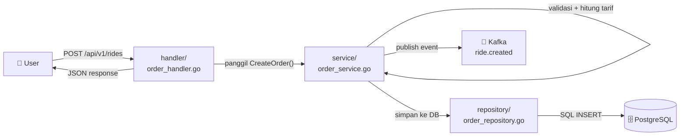
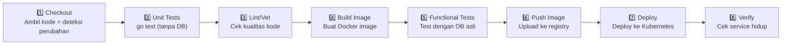
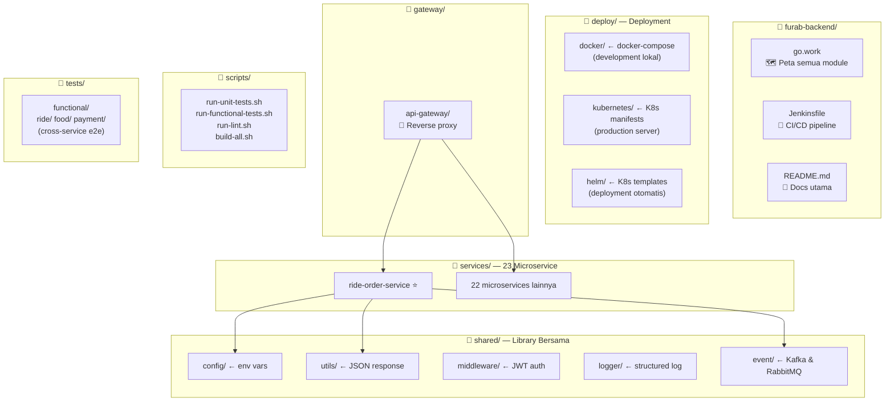

# Furab — Super-App Backend (Microservices Architecture)

## Gambaran Besar

Furab adalah backend super-app berbasis **microservices** yang dibangun menggunakan **Go (Golang)**. Arsitekturnya terdiri dari **23 microservice** independen yang saling berkomunikasi melalui **Kafka** dan **RabbitMQ**, dengan satu **API Gateway** sebagai pintu masuk utama. Seluruh service di-deploy ke **Kubernetes** menggunakan **Helm chart** dan diotomasi melalui **Jenkins CI/CD pipeline**.

```
furab-backend/
├── services/          ← 🏪 Semua "toko" (microservice)
├── shared/            ← 🧰 Peralatan yang dipakai semua toko
├── gateway/           ← 🚪 Pintu masuk utama (proxy)
├── deploy/            ← 📦 Cara "membungkus" dan "mengirim" toko ke server
├── scripts/           ← 🔧 Script otomasi (test, build, lint)
├── tests/             ← 🧪 Test yang melibatkan banyak toko sekaligus
├── go.work            ← 🗺️ Peta yang menghubungkan semua module Go
├── Jenkinsfile        ← 🤖 Instruksi robot CI/CD
└── README.md          ← 📖 Dokumentasi utama
```

---

## 1. Folder `services/` — Semua Microservice

Ini folder **paling penting**. Berisi 23 microservice yang masing-masing **independen**.

```
services/
├── ride-order-service/    ← Kelola pesanan ojek
├── food-order-service/    ← Kelola pesanan makanan
├── auth-service/          ← Login, register, logout
├── payment-service/       ← Proses pembayaran
├── ...dst
```

### Isi setiap service (contoh: ride-order-service)

```
ride-order-service/
│
├── cmd/
│   └── main.go                ← 🚀 ENTRY POINT: file pertama yang dijalankan
│                                  Tugasnya: konek DB, setup router, start server
│
├── internal/                  ← 📦 Kode internal (tidak bisa diimport service lain)
│   ├── model/
│   │   └── order.go           ← 📋 DEFINISI DATA: struct RideOrder, Location, Status
│   │                             Seperti "blueprint" data. Menentukan field apa saja
│   │                             yang ada di tabel database.
│   │
│   ├── repository/
│   │   └── order_repository.go ← 💾 AKSES DATABASE: SQL query INSERT, SELECT, UPDATE
│   │                              Layer ini HANYA berbicara dengan database.
│   │                              Contoh: "ambil order dari DB berdasarkan ID"
│   │
│   ├── service/
│   │   └── order_service.go   ← 🧠 BUSINESS LOGIC: logika bisnis utama
│   │                             Contoh: "hitung tarif", "validasi status boleh berubah
│   │                             dari PENDING ke ASSIGNED atau tidak"
│   │                             Layer ini panggil repository + publish event
│   │
│   └── handler/
│       └── order_handler.go   ← 🌐 HTTP HANDLER: terima request dari user
│                                 Contoh: POST /api/v1/rides → panggil service.CreateOrder
│                                 Layer ini convert JSON request → panggil service → return JSON
│
├── test/
│   ├── unit/                  ← 🧪 UNIT TEST: test tanpa database
│   │   ├── order_service_test.go  ← Test business logic dengan mock
│   │   └── mock/                  ← Mock (tiruan) repository & event publisher
│   │       ├── mock_order_repository.go
│   │       └── mock_event_publisher.go
│   │
│   └── functional/            ← 🧪 FUNCTIONAL TEST: test dengan database asli
│       └── order_functional_test.go
│
├── migrations/
│   └── 001_create_ride_orders.sql  ← 📊 SQL untuk buat tabel di PostgreSQL
│
├── api/
│   └── swagger.yaml           ← 📖 Dokumentasi API (OpenAPI spec)
│
├── go.mod                     ← 📋 Daftar dependency service ini
├── Dockerfile                 ← 🐳 Instruksi build Docker image
└── README.md                  ← 📖 Dokumentasi service
```

### Alur data (dari request masuk sampai response keluar):



---

## 2. Folder `shared/` — Library yang Dipakai Semua Service

```
shared/
├── config/
│   └── config.go          ← ⚙️ Baca konfigurasi dari environment variable
│                             Contoh: DB_HOST, DB_PORT, KAFKA_BROKERS
│                             Semua service pakai ini agar format config konsisten
│
├── utils/
│   └── response.go        ← 📤 Format response JSON yang seragam
│                             Semua API punya format yang sama:
│                             { "success": true, "data": {...}, "error": "" }
│
├── middleware/
│   └── auth_middleware.go  ← 🔐 Cek JWT token di setiap request
│                             Kalau token tidak valid → tolak request (401)
│                             Kalau valid → lanjut ke handler
│
├── logger/
│   └── logger.go          ← 📝 Logging terstruktur (JSON di production)
│                             Contoh output: {"level":"INFO","service":"ride-order","msg":"order created"}
│
└── event/
    ├── event.go            ← 📡 Interface untuk publish/subscribe event
    │                         Definisi: Event = { ID, Type, Payload, Timestamp }
    │
    ├── kafka/
    │   └── producer.go     ← 📡 Implementasi publish event via Kafka
    │                         DIGUNAKAN UNTUK: ride events, food events, location updates
    │                         (event yang high-throughput / banyak datanya)
    │
    └── rabbitmq/
        └── producer.go     ← 📡 Implementasi publish event via RabbitMQ
                              DIGUNAKAN UNTUK: payment events, notification, email
                              (event yang butuh reliability / jaminan terkirim)
```

### Kenapa ada Kafka DAN RabbitMQ?

| Aspek | Kafka | RabbitMQ |
|-------|-------|----------|
| **Kelebihan** | Super cepat, bisa jutaan event/detik | Reliable, ada acknowledgment |
| **Cocok untuk** | Location tracking, ride events | Payment, notification |
| **Analogi** | Seperti radio FM (broadcast) | Seperti kurir paket (pasti sampai) |

---

## 3. Folder `gateway/` — Pintu Masuk API

```
gateway/
└── api-gateway/
    ├── cmd/main.go                    ← Entry point gateway
    ├── internal/router/router.go      ← 🚦 ROUTING: arahkan request ke service yang tepat
    ├── go.mod
    ├── Dockerfile
    └── README.md
```

### Cara kerja gateway:

```
User request: GET /api/v1/rides/123
    ↓
API Gateway menerima
    ↓
Cek path "/rides/*" → forward ke ride-order-service (port 8085)
    ↓
ride-order-service memproses
    ↓
Response kembali ke user via gateway
```

**Tanpa gateway**: User harus tahu port setiap service (8081, 8082, dst)
**Dengan gateway**: User cukup akses 1 URL, gateway yang atur sisanya

---

## 4. Folder `deploy/` — Deployment & Infrastructure

```
deploy/
├── docker/
│   ├── docker-compose.yml      ← 🐳 Jalankan SEMUA service + DB + Kafka di lokal
│   └── init-multiple-dbs.sh    ← 📊 Script otomatis buat database per service
│
├── kubernetes/
│   ├── namespace.yaml          ← ☸️ Buat "ruang kerja" di Kubernetes
│   └── ride-order-service/
│       ├── deployment.yaml     ← ☸️ Instruksi deploy service (berapa replika, resource limit)
│       └── service.yaml        ← ☸️ Expose service ke network internal K8s
│
└── helm/
    └── furab-chart/
        ├── Chart.yaml          ← ⎈ Metadata Helm chart
        ├── values.yaml         ← ⎈ Konfigurasi deployment (replika, port, registry)
        └── templates/
            ├── deployment.yaml ← ⎈ Template dinamis: generate Deployment untuk semua 23 service
            └── service.yaml   ← ⎈ Template dinamis: generate Service (port exposure) untuk semua 23 service
```

### Penjelasan detail:

#### `docker-compose.yml` — Untuk Development Lokal
```
Satu file ini bisa start:
- PostgreSQL (database)
- Kafka + Zookeeper (message broker)
- RabbitMQ (message broker)
- Semua microservice

Cara pakai: docker-compose up -d
Semua jalan di laptop kamu tanpa perlu server.
```

#### `kubernetes/` — Untuk Production Server
```
Kubernetes = "manajer" yang mengatur container di server production.
- deployment.yaml = "berapa container yang jalan, pakai image apa"
- service.yaml = "gimana container bisa diakses dari luar"

Analogi: Docker = bikin kotak, Kubernetes = atur kotak-kotak di gudang besar
```

#### `helm/` — Template untuk Kubernetes
```
Helm = "package manager" untuk Kubernetes.
Daripada tulis 23 deployment.yaml manual, Helm generate semuanya
dari template di folder templates/ + konfigurasi di values.yaml.

- templates/deployment.yaml → loop semua service di values.yaml, generate Deployment per service
- templates/service.yaml    → loop semua service, generate Service (port) per service
- values.yaml               → konfigurasi replika, port, registry, database, dll

Analogi: Helm seperti "template surat" — tinggal ganti nama penerima
```

---

## 5. Folder `scripts/` — Otomasi

```
scripts/
├── run-unit-tests.sh          ← 🧪 Jalankan unit test SEMUA service sekaligus
├── run-functional-tests.sh    ← 🧪 Jalankan functional test (butuh DB running)
├── run-lint.sh                ← 🔍 Cek kualitas kode (go vet)
├── build-all.sh               ← 🏗️ Build Docker image untuk semua service
└── generate-skeletons.ps1     ← 🤖 Script yang generate 22 skeleton service
```

---

## 6. Folder `tests/` — Cross-Service Tests

```
tests/
└── functional/
    ├── ride/ride_e2e_test.go       ← Test alur lengkap ride (banyak service terlibat)
    ├── food/food_e2e_test.go       ← Test alur lengkap food order
    └── payment/payment_e2e_test.go ← Test alur lengkap payment
```

> [!NOTE]
> **Beda dengan test di dalam service:**
> - `services/ride-order-service/test/` → test **1 service saja**
> - `tests/functional/ride/` → test **alur yang melibatkan banyak service** (ride + matching + payment + notification)

---

## 7. `Jenkinsfile` — Robot CI/CD

### Apa itu Jenkinsfile?

Jenkinsfile adalah **instruksi otomatis** yang dijalankan Jenkins (CI/CD server) setiap kali ada push ke Git repository.



### Selective Build (Incremental Pipeline)

Pipeline ini mendukung **selective build**: ketika hanya 1-2 service yang berubah, pipeline hanya menjalankan test, build, push, dan deploy untuk service yang berubah saja — tanpa menyentuh service lainnya.

Deteksi perubahan dilakukan di **Stage Checkout** menggunakan `git diff` antara commit sebelumnya dan commit terbaru:

| Kondisi Perubahan | Mode Pipeline |
|:---|:---|
| Hanya `services/auth-service/` berubah | **Selective** → hanya `auth-service` yang diproses |
| `shared/`, `deploy/`, atau `Jenkinsfile` berubah | **Build All** → semua 23 service diproses |
| Build pertama kali (belum ada history) | **Build All** → semua 23 service diproses |

### Analogi sederhana:
```
Jenkinsfile = resep masak otomatis

1. Ambil bahan + cek mana yang baru (checkout + deteksi perubahan)
2. Cek bahan bagus (unit test)
3. Cek bahan bersih (lint)
4. Masak (build image)
5. Coba rasa (functional test)
6. Bungkus (push image)
7. Kirim ke restoran (deploy)
8. Pastikan sampai (verify)

Kalau SATU langkah gagal → BERHENTI, tidak lanjut ke langkah berikutnya.
Kalau hanya 1 menu yang berubah → hanya menu itu yang diproses ulang.
```

---

## 8. `go.mod` vs `go.work` — Apa Bedanya?

### `go.mod` — Daftar Dependency per Service

Setiap service punya `go.mod` sendiri. File ini berisi:
- Nama module
- Versi Go minimal
- Library apa saja yang dipakai

```go
// services/ride-order-service/go.mod

module furab-backend/services/ride-order-service  ← nama module ini

go 1.22  ← minimal Go 1.22

require (
    github.com/go-chi/chi/v5 v5.0.12        ← HTTP router
    github.com/google/uuid v1.6.0            ← Generate UUID
    github.com/jackc/pgx/v5 v5.6.0           ← PostgreSQL driver
    go.uber.org/mock v0.4.0                  ← Mocking library
    furab-backend/shared v0.0.0              ← Shared library kita sendiri
)

replace furab-backend/shared => ../../shared  ← "shared itu ada di folder ../../shared"
```

**Analogi**: `go.mod` seperti **daftar belanja** per toko. Setiap toko punya daftar belanja sendiri.

### `go.work` — Menghubungkan Semua Module

```go
// go.work (di root project)

go 1.22

use (
    ./shared                          ← shared library
    ./gateway/api-gateway             ← API gateway
    ./services/auth-service           ← service 1
    ./services/ride-order-service     ← service 2
    ./services/food-order-service     ← service 3
    // ... 20 service lainnya
)
```

**Analogi**: `go.work` seperti **peta mall** yang menunjukkan di mana semua toko berada.

### Perbandingan:

| Aspek | `go.mod` | `go.work` |
|-------|----------|-----------|
| **Di mana** | Di setiap service | Di root project (1 file saja) |
| **Isinya** | Dependency service itu | Daftar semua module |
| **Fungsi** | "Service ini butuh library X, Y, Z" | "Semua module ada di folder ini" |
| **Jumlah** | 25 file (23 service + shared + gateway) | 1 file |
| **Wajib** | Ya, setiap Go module harus punya | Opsional, tapi sangat membantu |

### Kenapa butuh keduanya?

```
TANPA go.work:
  ride-order-service butuh "shared"
  → Go cari di internet: "furab-backend/shared" → NOT FOUND! ❌

DENGAN go.work:
  ride-order-service butuh "shared"
  → Go lihat go.work → "oh shared ada di ./shared" → FOUND! ✅
```

---

## 9. Cara Test per Service

### Unit Test (TANPA Database)

```powershell
# Masuk ke folder service yang ingin ditest
cd d:\Pekerjaan\furabapps\furab-backend\services\ride-order-service

# Jalankan unit test
go test ./test/unit/... -v
```

**Apa yang terjadi:**
1. Go membaca file `test/unit/order_service_test.go`
2. Setiap function `TestXxx` dijalankan
3. Mock (tiruan) digunakan, BUKAN database asli
4. Output menunjukkan PASS atau FAIL per test

**Contoh output BERHASIL:**
```
=== RUN   TestCreateOrder_Success
--- PASS: TestCreateOrder_Success (0.00s)
=== RUN   TestCreateOrder_InvalidPickup
--- PASS: TestCreateOrder_InvalidPickup (0.00s)
=== RUN   TestAssignDriver_Success
--- PASS: TestAssignDriver_Success (0.00s)
PASS
ok      furab-backend/services/ride-order-service/test/unit    0.015s
                                                               ↑
                                                          waktu eksekusi
```

**Contoh output GAGAL:**
```
=== RUN   TestCreateOrder_Success
    order_service_test.go:95: expected status PENDING, got: ASSIGNED
--- FAIL: TestCreateOrder_Success (0.00s)
FAIL                              ← ❌ ada yang salah
exit status 1
```

### Functional Test (DENGAN Database)

```powershell
# 1. Pastikan PostgreSQL jalan dulu
docker run -d --name pg-test `
  -e POSTGRES_USER=furab `
  -e POSTGRES_PASSWORD=furab_secret `
  -e POSTGRES_DB=ride_order_service_test `
  -p 5432:5432 postgres:16-alpine

# 2. Jalankan functional test
cd d:\Pekerjaan\furabapps\furab-backend\services\ride-order-service
go test ./test/functional/... -v -tags=functional
```

> [!IMPORTANT]
> **`-tags=functional`** ← ini WAJIB! Tanpa flag ini, functional test tidak akan dijalankan. Ini sengaja agar ketika kamu run `go test` biasa, functional test tidak ikut jalan (karena butuh DB).

### Ringkasan cara test:

| Jenis Test | Command | Butuh DB? | Flag |
|------------|---------|-----------|------|
| Unit test 1 service | `go test ./test/unit/... -v` | ❌ Tidak | - |
| Functional test 1 service | `go test ./test/functional/... -v -tags=functional` | ✅ Ya | `-tags=functional` |
| Unit test SEMUA service | `./scripts/run-unit-tests.sh` | ❌ Tidak | - |
| Functional test SEMUA | `./scripts/run-functional-tests.sh` | ✅ Ya | - |
| Lint / code check | `go vet ./...` | ❌ Tidak | - |

### Test coverage (opsional, lihat seberapa banyak kode yang ditest):
```powershell
cd services/ride-order-service
go test ./test/unit/... -v -cover -coverprofile=coverage.out
go tool cover -html=coverage.out
# Buka file HTML di browser → warna hijau = sudah ditest, merah = belum
```

---

## Ringkasan Visual


